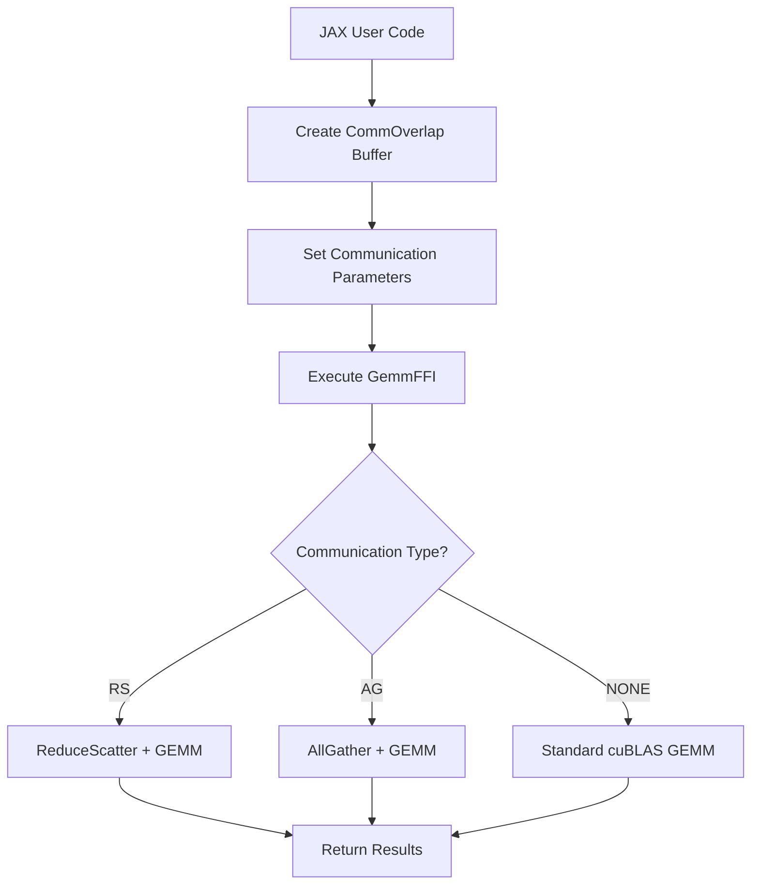
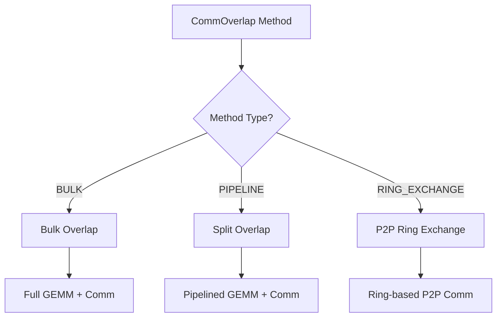
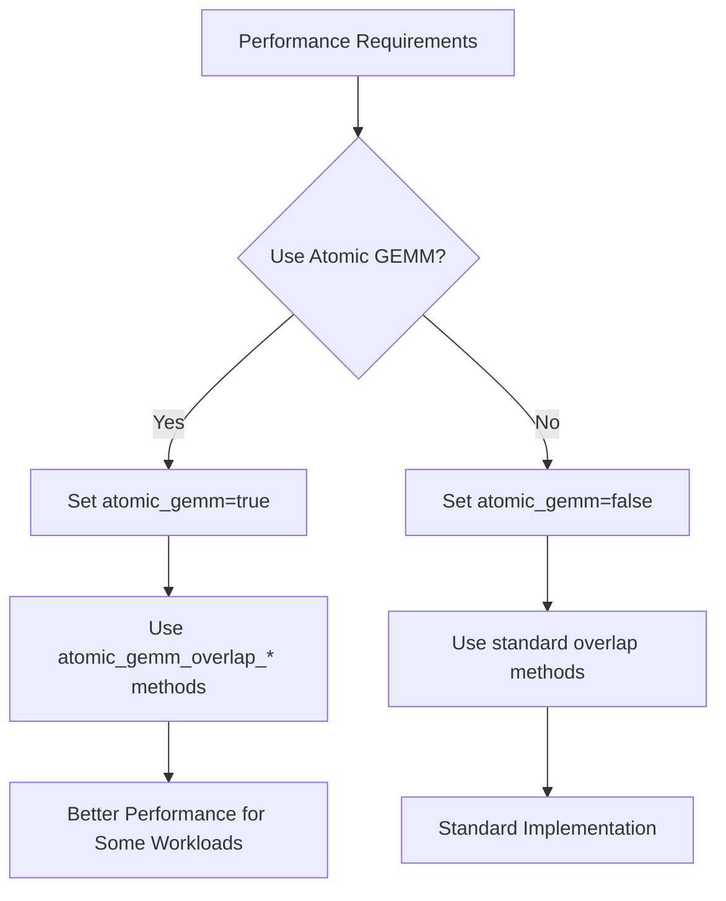

# CommGemm Documentation Master Index

## Overview
This document serves as a comprehensive index for all CommGemm-related documentation in Transformer Engine. It provides navigation, usage flows, and troubleshooting guidance for the communication-GEMM overlap system.

## Documentation Structure

### 1. Core Documentation Files
- **[CommOverlap Classes Documentation](CommOverlap_Classes_Documentation.md)**: C++ class hierarchy and implementation details
- **[JAX CommGemm Extension Documentation](JAX_CommGemm_Extension_Documentation.md)**: JAX extension implementation and API
- **[JAX CommGemm Implementations Documentation](JAX_CommGemm_Implementations_Documentation.md)**: Specific CommGemm operation implementations

### 2. Quick Reference
- **File Locations**: Key source files and their purposes
- **Class Hierarchy**: Visual representation of CommOverlap classes
- **API Reference**: Quick lookup for functions and parameters

## System Architecture

### High-Level Architecture
```
JAX User Code
    ↓
JAX Primitives (GemmPrimitive, etc.)
    ↓
XLA FFI Handlers (GemmHandler, GroupedGemmHandler)
    ↓
JAX Extension (gemm.cpp)
    ↓
CommOverlap Classes (CommOverlapBase, CommOverlapP2PBase)
    ↓
CUDA Kernels + Communication Libraries
```

### Class Relationships
```
CommOverlapCore (Abstract Base)
├── CommOverlapBase (Collective Operations)
│   ├── bulk_overlap()
│   ├── atomic_gemm_overlap_rs()
│   └── split_overlap_rs()
└── CommOverlapP2PBase (Point-to-Point Operations)
    ├── atomic_gemm_overlap_ag()
    ├── split_overlap_ag()
    ├── atomic_gemm_overlap_rs()
    └── split_overlap_rs()
```

## Usage Flow Diagrams

### 1. Standard CommGemm Flow


### 2. Communication Method Selection


### 3. Atomic GEMM Decision Flow


## API Reference

### Key Functions

#### 1. Buffer Management
```cpp
// Create CommOverlap buffer
int64_t CreateCommOverlapBuffer(CommOverlapType comm_type, 
                               CommOverlapMethod method,
                               const std::vector<size_t> &buffer_shape,
                               DType buffer_dtype,
                               int tp_size,
                               bool atomic_gemm,
                               ...);

// Destroy CommOverlap buffer
void DestroyCommOverlapBuffer(size_t unique_id);

// Destroy all buffers
void DestroyAllCommOverlapBuffers();
```

#### 2. Main GEMM Operations
```cpp
// Standard GEMM with communication overlap
Error_Type GemmFFI(cudaStream_t stream,
                   Buffer_Type lhs, Buffer_Type rhs,
                   CommOverlapMethod comm_overlap_method,
                   CommOverlapType comm_type,
                   int64_t comm_overlap_id,
                   ...);

#### 3. CommOverlap Methods
```cpp
// Bulk overlap (CommOverlapBase only)
void bulk_overlap(const TensorWrapper &A, bool transa,
                  const TensorWrapper &B, bool transb,
                  TensorWrapper &D, ...);

// Split overlap with ReduceScatter
void split_overlap_rs(const TensorWrapper &A, bool transa,
                      const TensorWrapper &B, bool transb,
                      TensorWrapper &D, ...);

// Atomic GEMM overlap with ReduceScatter
void atomic_gemm_overlap_rs(const TensorWrapper &A, bool transa,
                           const TensorWrapper &B, bool transb,
                           TensorWrapper &D, ...);

// Split overlap with AllGather (P2P only)
void split_overlap_ag(const TensorWrapper &A, bool transa,
                      const TensorWrapper &B, bool transb,
                      TensorWrapper &D, ...);

// Atomic GEMM overlap with AllGather (P2P only)
void atomic_gemm_overlap_ag(const TensorWrapper &A, bool transa,
                           const TensorWrapper &B, bool transb,
                           TensorWrapper &D, ...);
```

### Key Parameters

#### Communication Parameters
- `CommOverlapType`: `NONE`, `RS` (ReduceScatter), `AG` (AllGather)
- `CommOverlapMethod`: `NONE`, `BULK`, `PIPELINE`, `RING_EXCHANGE`
- `atomic_gemm`: `true`/`false` for atomic GEMM operations
- `tp_size`: Tensor parallelism size

#### Scaling Parameters
- `JAXX_Scaling_Mode`: `NO_SCALING`, `DELAYED_TENSOR_SCALING`, `CURRENT_TENSOR_SCALING`, `MXFP8_1D_SCALING`

## Performance Guidelines

### 1. Communication Method Selection
- **BULK**: Use for simple communication patterns, lower overhead
- **PIPELINE**: Use for complex communication patterns, better overlap
- **RING_EXCHANGE**: Use for point-to-point communication, potentially better performance

### 2. Atomic GEMM Usage
- **Enable** (`atomic_gemm=true`): For workloads that benefit from atomic operations
- **Disable** (`atomic_gemm=false`): For standard workloads, lower memory usage

### 3. Scaling Mode Selection
- **NO_SCALING**: Standard FP32/FP16 operations
- **TENSOR_SCALING**: For quantized operations with tensor scaling
- **MXFP8_SCALING**: For MXFP8 operations with block-wise scaling

### 4. Buffer Management
- **Memory Alignment**: Ensure 256-byte alignment for optimal performance
- **Buffer Sharing**: Minimize memory overhead through buffer sharing
- **Stream Management**: Use separate streams for compute and communication

## Troubleshooting Guide

### Common Issues

#### 1. Buffer Size Errors
**Error**: "Buffer size is incorrect"
**Solution**: 
- Check tensor parallelism size (`tp_size`)
- Verify axis boundaries for auxiliary tensors
- Ensure proper shape calculations for communication operations

#### 2. Communication Setup Errors
**Error**: "Invalid collective type"
**Solution**:
- Verify `CommOverlapType` parameter
- Check if communication method supports the operation
- Ensure proper CommOverlap buffer creation

#### 3. Scaling Factor Errors
**Error**: "Missing inverse scaling factor"
**Solution**:
- Check scaling mode configuration
- Verify scaling factor tensor shapes
- Ensure proper swizzling for MXFP8 operations

#### 4. Performance Issues
**Symptoms**: Poor performance or high memory usage
**Solutions**:
- Try different `CommOverlapMethod` values
- Experiment with `atomic_gemm` parameter
- Check memory alignment and buffer sharing
- Verify stream management and overlap

### Debugging Tips

#### 1. Enable Debug Output
```cpp
// Add debug prints in your code
NVTE_CHECK(condition, "Debug message: ", variable_value);
```

#### 2. Check Buffer States
```cpp
// Verify buffer creation
auto buffer_id = CreateCommOverlapBuffer(...);
// Check if buffer exists
auto it = comm_overlaps.find(buffer_id);
if (it != comm_overlaps.end()) {
    // Buffer exists
}
```

#### 3. Validate Parameters
```cpp
// Check communication parameters
if (comm_type == CommOverlapType::AG && comm_overlap_method == CommOverlapMethod::BULK) {
    // This combination is not supported
    NVTE_ERROR("AllGather with bulk overlap not supported");
}
```

## Best Practices

### 1. Initialization
- Create CommOverlap buffers early in your program
- Use appropriate buffer shapes and data types
- Set proper tensor parallelism parameters

### 2. Parameter Selection
- Choose communication method based on your workload
- Experiment with atomic GEMM for performance optimization
- Use appropriate scaling modes for your precision requirements

### 3. Memory Management
- Ensure proper buffer alignment
- Minimize memory overhead through buffer sharing
- Clean up buffers when no longer needed

### 4. Performance Optimization
- Use separate streams for compute and communication
- Maximize overlap between operations
- Monitor performance and adjust parameters accordingly

## Related Resources

### Source Files
- `transformer_engine/common/include/transformer_engine/comm_gemm_overlap.h`
- `transformer_engine/jax/csrc/extensions/gemm.cpp`
- `transformer_engine/common/comm_gemm_overlap/comm_gemm_overlap.cpp`

### External Documentation
- [Transformer Engine Documentation](https://docs.nvidia.com/deeplearning/transformer-engine/)
- [JAX Documentation](https://jax.readthedocs.io/)
- [CUDA Documentation](https://docs.nvidia.com/cuda/)

### Examples and Tutorials
- Check the Transformer Engine examples directory for usage examples
- Review JAX integration examples in the documentation
- Look for performance tuning guides and best practices

## Version Information
- **Documentation Version**: 1.0
- **Transformer Engine Version**: Compatible with latest release
- **JAX Version**: Compatible with JAX 0.4.x and later
- **CUDA Version**: Compatible with CUDA 11.8 and later

## Support and Feedback
For issues, questions, or feedback:
1. Check this troubleshooting guide first
2. Review the individual documentation files
3. Consult the Transformer Engine documentation
4. Open an issue on the Transformer Engine GitHub repository

---

*This master index provides a comprehensive overview of the CommGemm system. For detailed information, refer to the individual documentation files listed above.*
